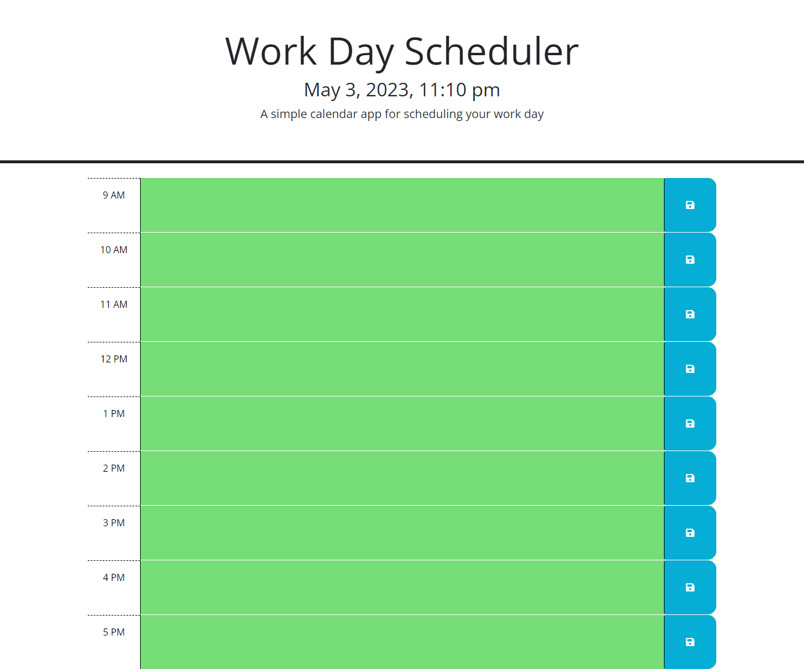

# Daily-Scheduler

A simple daily work schedule application providing a scheduling function for standard 9AM-5PM business hours.

## Description

This is a basic daily work scheduling application that will allow the user to save their daily tasks and revisit the schedule to see which events have past, which events are current and which events are upcoming. When a time block has past, it will appear in gray. When an hour is current, it will appear in red. When an hour is in the future, it will appear in green.

### List of Features 

1. Saved events from the local storage appear on page load. 
2. User has the ability to add or replace events in the time blocks, and save them to the local storage so they render to the page on page load. 
3. User has the ability to easily discern what hours have passed, are current, or are in the future. 

### Usage

This application is used to schedule work events between 9am-5pm. 

### Preview:

